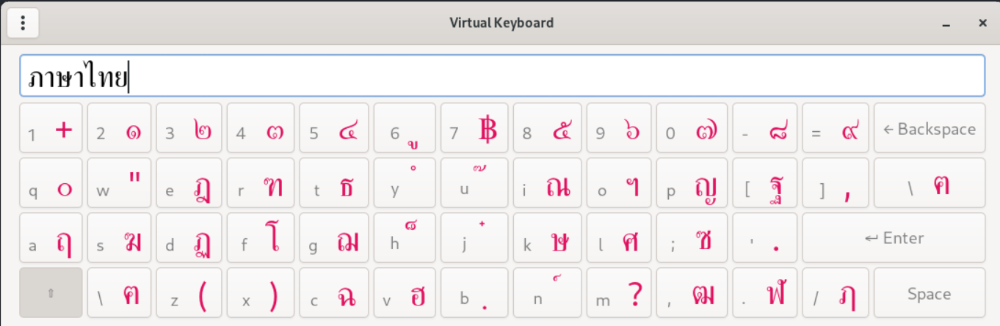

# virtual-keyboard

I have realized I need some sort of virtual keyboard so that I can type different alphabets faster with UK keyboard layout.

I have been inspired by [this website](https://www.branah.com/) in my trilingual language journey.





### Dependencies

- Python (>=3.11) download [here](https://www.python.org/downloads/)
- GTK (>=4) download [here](https://gnome.pages.gitlab.gnome.org/pygobject/getting_started.html)

Note: please don't do global system installation of python dependencies through pip, poetry can install it safely for you

Run with python

```shell
poetry shell && poetry install
python ./keyboard.py
```

Or roll your own binary

```shell
poetry shell && poetry install --with dev
poetry run pyinstaller --clean --onefile -w --add-data "data/style.css:./data" --exclude-module=pytest keyboard.py
./dist/keyboard
```

### FAQs

- Do you plan to add more languages?

We can consider as long as we don't break existing languages

- Why Python?

Safest way to touch GTK and not become a sociopath even if python binding is not feasible and has no docs. 

- Why GTK?

I use GNOME so I wanted to feel the native experience even though I hate every library GLib ecosystem produce in raw complex macro-maniac C

- Will you support GTK3 or Python 2.7?

No, please use up-to-date software

- Why no binaries through releases?

Life is hard with shared C libraries and Python libc dependent behaviour, I would need custom github actions runner and insane budget to produce binary for every system.

### TODOs

- [X] Design the layout for buttons with label size and color
- [X] Finish the text area input implementation with Gtk.Entry
- [X] Add sub-menu to pick target languages
- [X] Key Event presses follows target language mapping
- [X] Port it to GTK 4
- [ ] Tint animation on keyboard pressed/released buttons
- [ ] Use multi-line text area input implementation with Gtk.TextView
- [ ] Bug fix on grid grow/shrink not adapting the window
- [ ] Bug fix on CTRL+A and CTRL+C and CTRL+V shortcuts
