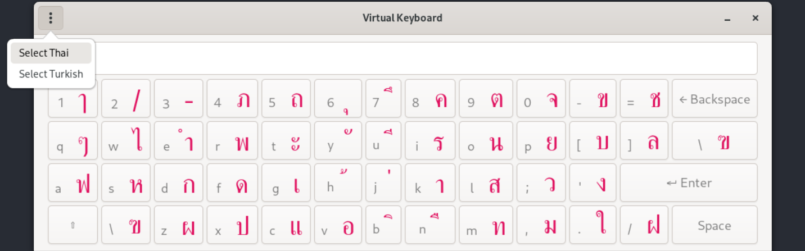
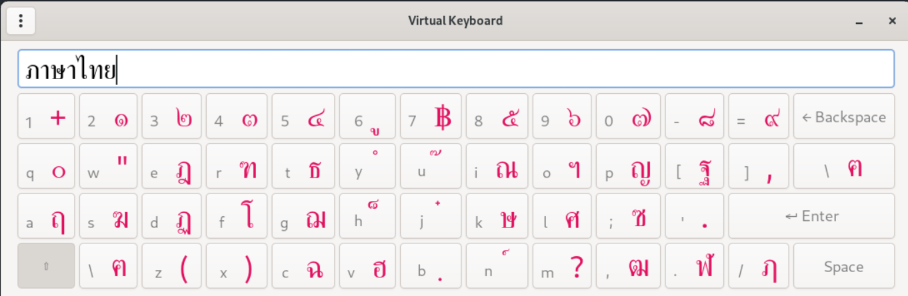
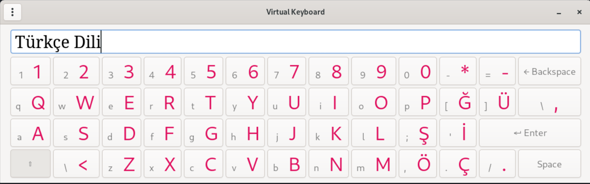

# virtual-keyboard

I have realized I need some sort of virtual keyboard so that I can type different alphabets faster with UK keyboard layout.

I have been inspired by [this website](https://www.branah.com/) in my trilingual language journey.







### Dependencies

- Python (>=3.11)
- GTK 4 (you can see what you need to download on [here](https://gnome.pages.gitlab.gnome.org/pygobject/getting_started.html))

Note: please don't do global system installation of python dependencies through pip, poetry can install it safely for you

```shell
poetry shell && poetry install
python ./keyboard.py
```

### TODOs

- [X] Design the layout for buttons with label size and color
- [X] Finish the text area input implementation with Gtk.Entry
- [X] Add sub-menu to pick target languages
- [X] Key Event presses follows target language mapping
- [X] Port it to GTK 4
- [ ] Release executable binaries for linux/windows through releases
- [ ] Tint animation on keyboard pressed/released buttons
- [ ] Use multi-line text area input implementation with Gtk.TextView
- [ ] Bug fix on grid grow/shrink not adapting the window
- [ ] Bug fix on CTRL+A and CTRL+C and CTRL+V shortcuts
